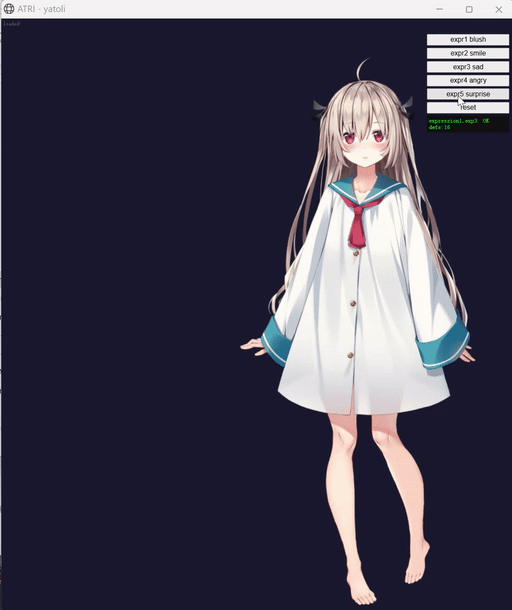
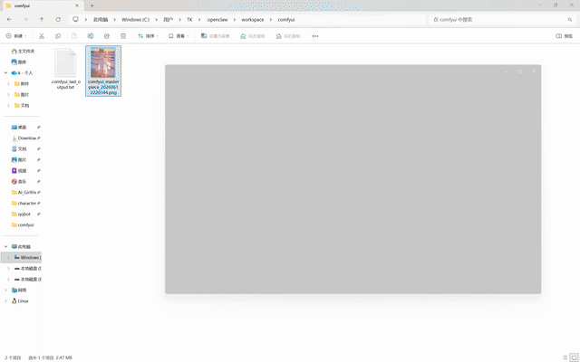

# AI Girlfriend — Shiki Natsume (四季夏目)

**100% Local · Fully Private · Zero API Dependencies**

> All conversations, voice, images, and character animations are generated on your own machine. No cloud servers, no third-party APIs, no risk of data leakage. Your AI girlfriend belongs to you, and only you.

---

An AI girlfriend project powered by OpenClaw + QQ Bot + Telegram Bot + llama.cpp + GPT-SoVITS + ComfyUI + Sakura Desktop Pet + Live2D — running entirely on your own machine.

**Characters**: Supports hot-swappable AI girlfriends with isolated memories per character.

### Shiki Natsume (四季夏目)

From *Starry Moonlit Café & the Butterfly of Death*. Tall, aloof, cool exterior with a hidden warmth. A natural quietly-dominant type — she takes the lead, teases you gently, and guards you fiercely. Speaks little, but every word hits.

### ATRI (亚托莉)

From *ATRI -My Dear Moments-*. Petite, innocent, endlessly curious — a bright-eyed girl who wears her heart on her sleeve. Runs toward the future with a smile, dragging you along. **The polar opposite of Natsume**: bubbly and expressive where Natsume is reserved, emotionally transparent where Natsume is guarded, playful where Natsume is composed. If Natsume is the cool winter night, ATRI is the warm summer sun.

## ✨ Why This Project?

| | Cloud AI Girlfriend | This Project |
|---|---------------------|--------------|
| 🛡️ **Privacy** | Chat logs, voice, and images all stored on vendor servers | **Everything stays local** — zero data leaves your machine |
| 💰 **Cost** | Monthly subscriptions / per-token billing adds up | **Free**, one-time setup, runs forever (bring your own hardware) |
| 🌐 **Network** | Needs internet; dead if servers go down | **Works offline** — flip off your WiFi and keep chatting |
| 🎛️ **Control** | Prompts/templates controlled by vendor, can change anytime | **You control** all models, parameters, and character settings |
| 🔞 **Content** | Heavy censorship, accounts get banned | **No censorship** — talk about whatever you want |
| 🎨 **Extensibility** | Locked into vendor models and features | **Mix and match** — swap LLMs, image models, voice models freely |

## 🎬 Demo

### Multi-Channel Chat


> 👆 QQ Bot: text chat + TTS voice + ComfyUI image generation + character memory

### Live2D Desktop Pet


> 👆 **Shiki Natsume** Live2D: real-time character animation with emotion-driven motions, lip-sync, and speech bubbles. Controlled via local HTTP bridge.

### ⭐ ATRI — Second AI Girlfriend

**Personality opposite of Natsume**, hot-swappable with isolated memory.



> 👆 **ATRI** Live2D: silver hair, ruby-red eyes, barefoot in a white dress — innocent and expressive.



> 👆 **ATRI** ComfyUI: AI image generation — seaside sunset, flowing white dress, warm golden-hour lighting.

## Hardware

| Component | Model |
|-----------|-------|
| GPU | NVIDIA GeForce RTX 5070 Laptop (8 GB VRAM) |
| CPU | Intel Core i9-14900HX (24 cores, 32 threads) |
| RAM | 32 GB DDR5 |
| OS | Windows 11 |

## Features

- 💬 **QQ + Telegram Dual Channel** — QQ Bot + Telegram Bot integration via OpenClaw Gateway
- 🎤 **TTS Voice Synthesis** — Local GPT-SoVITS inference, Japanese voice (emotion-matched per dialogue)
- 🎨 **AI Image Generation** — Local ComfyUI inference, SDXL/Illustrious models
- 🖥️ **Sakura Desktop Pet** — PySide6 desktop companion with proactive care, screen observation & local LLM awareness
- 🎭 **Live2D Character Model** — Real-time Live2D rendering with 10 motion groups, emotion-driven expressions, and speech bubbles
- 🧠 **VRAM Scheduler** — Automatic llama-server ↔ TTS/ComfyUI orchestration on 8 GB VRAM
- 💾 **Roleplay Memory** — Conversation summaries persisted to `memory/role_play/`
- 🔄 **Multi-Character Hot-Swap** — Switch between AI girlfriends (Natsume ⇄ ATRI) with one command; SOUL/IDENTITY/TTS weights/Live2D model all switch automatically, memories isolated per character
- 🃏 **Character Card Import** — Auto-detect SillyTavern character cards via `skills/character_importer/`, import → agent auto-switches role
- 💬 **Chat Import** — Import SillyTavern JSONL chat logs into `memory/role_play/<character>/`, agent restores conversation context on role switch

## Models

All models hosted on HuggingFace: **[TAOTAO777/ai-girlfriend-natsume](https://huggingface.co/TAOTAO777/ai-girlfriend-natsume)**

See [`models.yaml`](models.yaml) for full details.

| Model | Purpose | Size |
|-------|---------|------|
| **Qwen3.6-35B-A3B-APEX-I-Compact** (Q4_K GGUF) | Chat LLM | 16.11 GB |
| **WAI-Nsfw-Illustrious-17** | ComfyUI generation (default) | 6.46 GB |
| **miaomiaoHarem_v20** | ComfyUI generation (backup) | 6.46 GB |
| **GPT-SoVITS voice weights** | TTS voice synthesis | ~303 MB |

### One-command Download

```powershell
# Install huggingface-cli: pip install huggingface_hub
huggingface-cli login

# Download all models
huggingface-cli download TAOTAO777/ai-girlfriend-natsume --local-dir ./models

# Or download individual components:
huggingface-cli download TAOTAO777/ai-girlfriend-natsume llm/ --local-dir ./models
huggingface-cli download TAOTAO777/ai-girlfriend-natsume comfyui-checkpoints/ --local-dir ./checkpoints
huggingface-cli download TAOTAO777/ai-girlfriend-natsume gpt-sovits-weights/ --local-dir ./gpt-sovits-weights
```

### Local Configuration

1. **Run `quick_setup.ps1`** — interactive wizard that generates `config.yaml` with your local paths
2. (Alternative) Copy `config.example.yaml` → `config.yaml` and edit manually
3. Place downloaded model files according to `models.yaml`, then update `config.yaml` paths

All Python/PS scripts read paths from `config.yaml` — no hardcoded paths to edit.

> ⚠️ **Disclaimer**: All models are community open-source. This project only provides mirror distribution, non-profit. Copyright belongs to original authors.

## Local LLM Performance

Running Qwen3.6-35B-A3B (MoE, Q4_K, 16.10 GiB, 34.66B params) via llama.cpp (b8851-b9222).

### Launch Command

```powershell
llama-server.exe `
  -m "Qwen3.6-35B-A3B-uncensored-heretic-APEX-I-Compact.gguf" `
  -c 120000 `
  --flash-attn on -ctk q8_0 -ctv q8_0 `
  -ngl 41 --cpu-moe --cpu-mask 0xFFFFFFFF `
  --batch-size 4096 --ubatch-size 2048 --threads 24 `
  --api-key *** -rea off --jinja `
  --cache-ram 2048 --parallel 1 `
  --kv-unified --no-mmap
```

### Key Metrics

| Metric | Value | Notes |
|--------|-------|-------|
| VRAM Usage | ~4.6 GiB (model) + ~1.2 GiB (KV cache) | ~2 GB free on 8 GB VRAM |
| Prefill Speed | **960 ~ 1390 t/s** | 120K context, batch-size 4096 |
| Token Generation | **31 ~ 39 t/s** | MoE architecture, 8/256 experts |
| Context Limit | 120K (~120k tokens) | ~59k token full reprocess in ~55s |
| Model Load Time | ~12s | --no-mmap, requires sufficient RAM |

### Long Context Stability

Qwen3.6 MoE uses SSM (Gated Delta Net) hybrid attention with `--kv-unified`.

⚠️ **Known Limitation**: Cross-turn prompt cache reuse is not supported (SSM architecture limitation). Each request triggers full context re-processing. Longer conversations = higher first-token latency (~55s for 59k tokens).

**Mitigations**:
- Periodic `/reset` (Natsume writes roleplay summaries to `memory/role_play/` before resetting)
- Restore context from summaries on startup, keeping actual token count in 5K–20K range
- `config-patch.json` sets OpenClaw contextWindow to 262144 to match model capacity

### VRAM Budget

```
8 GB Total VRAM
├── llama-server resident: ~5.8 GB (model 4.6G + KV cache 1.2G)
├── Free: ~2.2 GB
│
├── TTS inference: stop llama → ~8 GB free → resume llama (~70s)
└── ComfyUI generation: stop llama → ~8 GB free → resume llama (~120s)
```

## Directory Structure

```
AI_Girlfriend/                        # OpenClaw workspace root
├── start.ps1                         # 🚀 One-click launch: llama + Live2D + Gateway
├── quick_setup.ps1                     # 🛠 Interactive path config wizard
├── config.yaml                       # Generated config
├── download-models.ps1               # One-click model download (Windows)
├── download-models.sh                # One-click model download (Linux/macOS)
├── setup-llama.ps1                   # Auto-detect HW + configure llama.cpp (Win)
├── setup-llama.sh                    # Auto-detect HW + configure llama.cpp (Linux/macOS)
├── setup-openclaw.ps1                # One-click OpenClaw install + deploy (Win)
├── setup-openclaw.sh                 # One-click OpenClaw install + deploy (Linux/macOS)
├── setup-all.ps1                     # 🚀 All-in-One mega script (Windows)
├── setup-all.sh                      # 🚀 All-in-One mega script (Linux/macOS)
├── config-qqbot.json                 # QQ Bot config patch
├── config-telegram.json              # Telegram Bot config patch
├── config-patch.json                 # OpenClaw LLM config patch
├── AGENTS.md                         # Agent behavior rules
├── SOUL.md                           # Character personality
├── IDENTITY.md                       # Character identity
├── USER.md                           # User info
├── HEARTBEAT.md                      # Heartbeat config
├── TOOLS.md                          # Tool quick reference
├── models.yaml                       # Model catalog + download links
├── README.md                         # This file
├── .gitignore
├── live2d/                           # Live2D character model (Cubism 4 Core)
│   ├── index.html                    # Browser frontend (standalone window)
│   ├── embed.html                    # Embeddable version
│   ├── live2dcubismcore.min.js       # Cubism Core 4 (207 KB)
│   ├── plid-v5-bundle.js             # pixi-live2d-display v0.5.0 bundle
│   ├── live2d-bridge.mjs             # HTTP (19200) + WebSocket (19201) bridge
│   ├── pixi.min.js, pixi-shim.js     # PIXI.js v7 rendering
│   ├── model/shiki_natsume/          # Shiki Natsume model files
│   ├── media/                        # Generated screenshots
│   └── _archive/                     # Debug artifacts
├── ren_pro_jp/                       # Ren'Py dialog engine (planned)
├── memory/                           # [.gitignore] Runtime memory
│   └── role_play/                    # Roleplay conversation logs
├── media/                            # [.gitignore] Generated media
│   ├── audio/                        # TTS voice output
│   ├── images/                       # ComfyUI image output
│   └── *.gif                         # README demo GIFs
├── docs/
│   ├── telegram-setup.md             # Telegram Bot setup guide
│   └── qqbot-setup.md                # QQ Bot setup guide
└── skills/
    ├── live2d/                       # 🆕 Live2D control skill
    │   ├── SKILL.md                  # Live2D API invocation guide
    │   ├── scripts/start-live2d.ps1  # Live2D launcher
    │   └── media/                    # Shared media output
    ├── tts/
    │   ├── SKILL.md                  # TTS invocation guide
    │   ├── run_tts.ps1               # TTS launcher script
    │   ├── tts_call.py               # GPT-SoVITS inference
    │   └── ref_wavs/                 # Reference audio clips
    ├── comfyui/
    │   ├── SKILL.md                  # ComfyUI invocation guide
    │   ├── run_comfyui.ps1           # ComfyUI launcher script
    │   ├── comfyui_call.py           # ComfyUI inference
    │   ├── prompt_template.md        # Character prompt template
    │   └── custom_prompt.txt         # Custom extra prompt
    ├── sakura/                       # Sakura Desktop Pet (PySide6 GUI)
    │   ├── SKILL.md                  # Sakura skill documentation
    │   ├── main.py                   # Application entry point
    │   ├── install.bat               # Windows dependency installer
    │   ├── start.bat                 # Windows launcher
    │   └── app/                      # Source code
    ├── llama-management.md           # VRAM management architecture doc
    ├── llama-watchdog.ps1            # Llama health check
    ├── cleanup_orphans.ps1           # Orphan process cleanup
    └── character_importer/           # SillyTavern character card auto-import
```

## Skills Overview

| Skill | Type | Llama Kill? | Mechanism |
|-------|------|-------------|-----------|
| **Live2D** | HTTP exec | ❌ No | Direct HTTP calls to `localhost:19200` bridge |
| **TTS** | sessions_spawn | ✅ Yes | Kill → GPT-SoVITS → restart llama |
| **ComfyUI** | sessions_spawn | ✅ Yes | Kill → image gen → restart llama |
| **Sakura** | Shared llama-client | ❌ No | Detects llama down → waits → auto-resumes |

## Prerequisites

| Component | Version / Source | Purpose |
|-----------|-----------------|---------|
| [OpenClaw](https://docs.openclaw.ai) | latest | AI Agent Gateway |
| QQ Bot | OpenClaw qqbot channel | QQ message relay |
| Telegram Bot | OpenClaw telegram channel | Telegram message relay |
| [llama.cpp](https://github.com/ggml-org/llama.cpp) | b9222 | Local LLM inference server |
| [GPT-SoVITS v2](https://github.com/RVC-Boss/GPT-SoVITS) | v2pro-20250604 | TTS voice synthesis |
| [ComfyUI](https://github.com/comfyanonymous/ComfyUI) | aki-v3 | Image generation engine |
| [Sakura Desktop Pet](https://github.com/Rvosy/Sakura) | v0.9.6-dev | Desktop companion GUI |
| [pixi-live2d-display](https://github.com/guansss/pixi-live2d-display) | v0.5.0 | Live2D WebGL renderer |
| Live2D Cubism Core | 4.x (CDN: cubism.live2d.com/sdk-web/cubismcore/) | Live2D physics/animation |
| Python | 3.12+ | Runtime (Sakura + TTS + ComfyUI) |

## Quick Start

### 🚀 All-in-One (Recommended)

**One command, from scratch to a fully functional AI girlfriend:**

**Windows:**
```powershell
powershell -File setup-all.ps1
```

**Linux / macOS:**
```bash
bash setup-all.sh
```

Automated pipeline: environment check → model download → llama.cpp setup → OpenClaw install → Sakura desktop pet → workspace deploy → path check → launch → verify.

> Supports resume from breakpoint. Flags: `--skip-model-download`, `--skip-llama-setup`, `--skip-openclaw-setup`, `--skip-sakura-setup`, `--dry-run`, `--no-start`

---

### Step-by-Step

### 0. Setup OpenClaw

Install OpenClaw Gateway and deploy the AI Girlfriend workspace:

**Windows:**
```powershell
powershell -File setup-openclaw.ps1
```

**Linux / macOS:**
```bash
bash setup-openclaw.sh
```

This script installs Node.js, OpenClaw Gateway, deploys workspace files, installs daemon, and applies config patch.

> **Flags:** `--skip-node`, `--skip-deploy`, `--skip-daemon`, `--no-onboard`

### 1. Download Models

**Windows:**
```powershell
pip install huggingface_hub
huggingface-cli login
powershell -File download-models.ps1
```

**Linux / macOS:**
```bash
pip install huggingface_hub
huggingface-cli login
bash download-models.sh
```

Downloads all 5 model files (~31.7 GB) from HuggingFace with progress reporting and resume support.

### 2. Setup llama.cpp

Auto-detects GPU, VRAM, CPU cores, RAM and generates optimized launch configs.

**Windows:**
```powershell
powershell -File setup-llama.ps1
```

**Linux / macOS:**
```bash
bash setup-llama.sh
```

### 3. Configure Paths

```powershell
powershell -File quick_setup.ps1
```

Interactive wizard — enter your local paths once, all scripts are updated automatically.

### 4. Quick Launch

```powershell
# One-click start all services (llama + Live2D + Gateway)
powershell -File start.ps1
```

### 5. Start Live2D Individually

```powershell
# Start the bridge
Start-Process node -ArgumentList "live2d-bridge.mjs" -WorkingDirectory live2d -WindowStyle Hidden

# Open in standalone window (Chrome app mode)
Start-Process chrome -ArgumentList "--new-window --app=http://localhost:19200/index.html --window-size=450,650"
```

Live2D runs in a frameless Chrome window — place it anywhere on your desktop.

### 5. Windows Task Scheduler (optional)

```powershell
# Llama health check (every 10 min)
schtasks /create /tn "llama-watchdog" `
  /tr "powershell -File C:\Users\<you>\.openclaw\workspace\skills\llama-watchdog.ps1" `
  /sc minute /mo 10

# Orphan process cleanup (hourly)
schtasks /create /tn "cleanup-orphans" `
  /tr "powershell -File C:\Users\<you>\.openclaw\workspace\skills\cleanup_orphans.ps1" `
  /sc hourly /mo 1
```

## Architecture

```
User (QQ / Telegram) ────── Sakura Desktop Pet (PySide6)
  │                                    │
  ▼                                    ▼
OpenClaw Gateway              Live2D Bridge (:19200)
  │                               ▲       │
  ▼                               │       ▼
  ┌───── llama-server :8080 ──────┘   Browser (Live2D model)
  │         (Qwen3.6-35B)             │
  ├───────────────────────────────────┤
  │  Main session (roleplay)          │
  │  TTS (kill → GPU → restart)       │
  │  ComfyUI (kill → GPU → restart)   │
  │  Live2D (HTTP → no kill needed)   │
  └───────────────────────────────────┘
```

**Agent Hub — Immutable Capability Instructions**:

```
         ┌─────────────┐
         │  AGENTS.md   │  ← Capability hub (never changes on role switch)
         │  SOUL.md     │  ← Current character persona (hot-swappable)
         │  IDENTITY.md │  ← Character metadata
         │  TOOLS.md    │  ← Quick reference
         │  USER.md     │  ← User profile
         └──────┬───────┘
                │
    ┌───────────┴────────────┐
    ▼                        ▼
 ┌──────────────┐   ┌──────────────────────┐
 │ skills/harem/ │   │ memory/role_play/    │
 │   (存档后宫)  │   │   <角色>/ (独立记忆)   │
 │ ├─ natsume/   │   │ ├─ natsume/*.md      │
 │ └─ enola/     │   │ └─ enola/*.md        │
 └──────────────┘   └──────────────────────┘
```

- `AGENTS.md` stays constant across role switches — ComfyUI / TTS / Live2D instructions are preserved
- `SOUL.md` + `IDENTITY.md` are overwritten on switch; harem archives source of truth
- Memory per character isolated in `memory/role_play/<name>/` — never cross-contaminated
- SillyTavern character cards imported via PNG tEXt chunk parsing → auto-switch agent persona

**Four Skills, One Brain**:

| Skill | Location | Llama Interaction |
|-------|----------|-------------------|
| **Live2D** | `skills/live2d/` | HTTP API only — never touches llama |
| **TTS** | `skills/tts/` | Kill llama → GPT-SoVITS → restart + wait /health |
| **ComfyUI** | `skills/comfyui/` | Kill llama → image gen → restart + wait /health |
| **Sakura** | `skills/sakura/` | Shared llama-client; detects down → auto-resume |
| **Character Importer** | `skills/character_importer/` | Agent-level — no GPU needed; writes SOUL/IDENTITY + memory dir |

**VRAM Orchestration Flow**:
1. Main session receives user request → assembles command
2. `sessions_spawn(mode="run")` creates local model sub-session
3. Sub-session execs PS script → `stop_llama()` kills llama-server
4. Full 8 GB VRAM freed → TTS/ComfyUI inference
5. `start_llama()` restarts llama-server (~12s load + ~3s warmup)
6. Live2D remains active during entire cycle — bridge doesn't touch GPU
7. Sub-session writes `.task_flags` → announces back to main session
8. Main session reads media files → sends via `<qqmedia>` / `MEDIA:`

## ⚠️ Important Notes

- Llama-server is offline for ~60–120s during TTS/ComfyUI inference — conversation pauses, but Live2D keeps running
- Sub-sessions use **local model** (same as main), DeepSeek as optional fallback
- Llama-server does not support cross-turn prompt cache reuse (SSM limitation) — use periodic `/reset`
- **Live2D requires Cubism Core 4** (not 5 or 6) — pixi-live2d-display v0.5.0 is built for Cubism 4 Framework; Core 5+ causes clipping/layer failures
- All model files protected by `.gitignore`
- GPT-SoVITS weights are self-trained and not distributed — train with your own voice data

## 🙏 Credits

- [@Rvosy](https://github.com/Rvosy) — Creator of [Sakura Desktop Pet](https://github.com/Rvosy/Sakura), authorized for inclusion (Issue #38)
- [@guansss](https://github.com/guansss) — Creator of [pixi-live2d-display](https://github.com/guansss/pixi-live2d-display)
- [Live2D Inc.](https://www.live2d.com) — Cubism SDK (non-commercial use)
