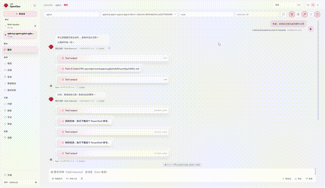
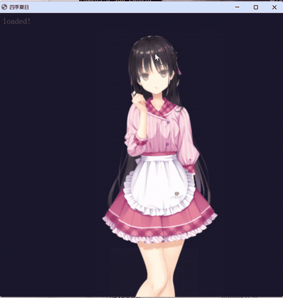

# AI 女友 — 四季夏目（Shiki Natsume）

**100% 本地 · 完全隐私 · 零 API 依赖**

> 所有对话、语音、图像和角色动画均在你自己电脑上生成。无云端服务器、无第三方 API、无数据泄露风险。你的 AI 女友只属于你。

---

基于 OpenClaw + QQ Bot + Telegram Bot + llama.cpp + GPT-SoVITS + ComfyUI + Sakura 桌宠 + Live2D 的 AI 女友项目——完全在你自己的机器上运行。

角色：**四季夏目**，出自《星光咖啡蝶与死神之馆》。高挑、清冷，外冷内热。定位为「女友体验」角色扮演——她会主动关心你，偶尔毒舌，安静陪伴。

## ✨ 为什么选这个项目？

| | 云端 AI 女友 | 本项目 |
|---|---------------------|--------------|
| 🛡️ **隐私** | 聊天记录、语音、图片全存在厂商服务器上 | **一切留在本地**——零数据外泄 |
| 💰 **费用** | 月费 / 按 token 计费，用得越多越贵 | **免费**，一次性部署，永久运行（自带硬件） |
| 🌐 **网络** | 断网即死；服务器挂了就没法用 | **离线可用**——关掉 WiFi 照样聊 |
| 🎛️ **控制** | 提示词/模板由厂商控制，随时可能变 | **你完全掌控**所有模型、参数和角色设定 |
| 🔞 **内容** | 严格审查，动不动封号 | **无审查**——想聊什么聊什么 |
| 🎨 **可扩展性** | 锁死在厂商模型和功能上 | **自由混搭**——随意换 LLM、画画模型、语音模型 |

## 🎬 演示

### 多通道聊天


> 👆 QQ Bot：文字聊天 + TTS 语音 + ComfyUI 画图 + 角色记忆

### Live2D 桌面宠物


> 👆 Live2D：实时角色动画，情绪驱动动作 + 口型同步 + 对话气泡。通过本地 HTTP 桥控制。

## 硬件配置

| 组件 | 型号 |
|-----------|-------|
| GPU | NVIDIA GeForce RTX 5070 笔记本 (8 GB 显存) |
| CPU | Intel Core i9-14900HX (24 核, 32 线程) |
| 内存 | 32 GB DDR5 |
| 系统 | Windows 11 |

## 功能特性

- 🃏 **SillyTavern 角色卡导入** — 自动检测导入 PNG/JSON 角色卡，导入后 agent 自动切换角色
- 💬 **聊天记录导入** — 导入 SillyTavern JSONL 对话记录到 `memory/role_play/<角色>/`，切换角色时 agent 恢复上下文
- 💬 **QQ + Telegram 双通道** — 通过 OpenClaw Gateway 接入 QQ Bot 和 Telegram Bot
- 🎤 **TTS 语音合成** — 本地 GPT-SoVITS 推理，日语语音（根据对话自动匹配情绪）
- 🎨 **AI 画图** — 本地 ComfyUI 推理，SDXL/Illustrious 模型
- 🖥️ **Sakura 桌宠** — PySide6 桌面伴侣，主动关心、屏幕观察 & 本地 LLM 感知
- 🎭 **Live2D 角色模型** — 实时 Live2D 渲染，10 个动作组，情绪驱动表情，对话气泡
- 🧠 **显存调度器** — 8 GB 显存上自动调度 llama-server ↔ TTS/ComfyUI
- 💾 **角色扮演记忆** — 对话摘要持久化到 `memory/role_play/`

## 模型

所有模型托管在 HuggingFace：**[TAOTAO777/ai-girlfriend-natsume](https://huggingface.co/TAOTAO777/ai-girlfriend-natsume)**

详见 [`models.yaml`](models.yaml)。

| 模型 | 用途 | 大小 |
|-------|---------|------|
| **Qwen3.6-35B-A3B-APEX-I-Compact** (Q4_K GGUF) | 聊天 LLM | 16.11 GB |
| **WAI-Nsfw-Illustrious-17** | ComfyUI 画图（默认） | 6.46 GB |
| **miaomiaoHarem_v20** | ComfyUI 画图（备用） | 6.46 GB |
| **GPT-SoVITS 语音权重** | TTS 语音合成 | ~303 MB |
| **四季夏目 Live2D 模型** | Live2D 角色渲染 | ~180 MB (压缩包) |

### 一键下载

```powershell
# 安装 huggingface-cli：pip install huggingface_hub
huggingface-cli login

# 下载所有模型
huggingface-cli download TAOTAO777/ai-girlfriend-natsume --local-dir ./models

# 或单独下载各个组件：
huggingface-cli download TAOTAO777/ai-girlfriend-natsume llm/ --local-dir ./models
huggingface-cli download TAOTAO777/ai-girlfriend-natsume comfyui-checkpoints/ --local-dir ./checkpoints
huggingface-cli download TAOTAO777/ai-girlfriend-natsume gpt-sovits-weights/ --local-dir ./gpt-sovits-weights
huggingface-cli download TAOTAO777/ai-girlfriend-natsume live2d-model/ --local-dir ./live2d-model
```

### 本地配置

1. **运行 `quick_setup.ps1`** — 交互式向导，自动生成 `config.yaml` 填入你的本地路径
2. （备选）复制 `config.example.yaml` → `config.yaml` 手动编辑
3. 根据 `models.yaml` 放置下载好的模型文件，然后更新 `config.yaml` 路径

所有 Python/PS 脚本从 `config.yaml` 读取路径——无需手动改硬编码路径。

> ⚠️ **声明**：所有模型均为社区开源模型。本项目仅提供镜像分发，非盈利。版权归原作者所有。

## 本地 LLM 性能

通过 llama.cpp (b8851-b9222) 运行 Qwen3.6-35B-A3B（MoE, Q4_K, 16.10 GiB, 34.66B 参数）。

### 启动命令

```powershell
llama-server.exe `
  -m "Qwen3.6-35B-A3B-uncensored-heretic-APEX-I-Compact.gguf" `
  -c 120000 `
  --flash-attn on -ctk q8_0 -ctv q8_0 `
  -ngl 41 --cpu-moe --cpu-mask 0xFFFFFFFF `
  --batch-size 4096 --ubatch-size 2048 --threads 24 `
  --api-key *** -rea off --jinja `
  --cache-ram 2048 --parallel 1 `
  --kv-unified --no-mmap
```

### 关键指标

| 指标 | 数值 | 备注 |
|--------|-------|-------|
| 显存占用 | ~4.6 GiB (模型) + ~1.2 GiB (KV 缓存) | 8 GB 显存剩余约 2 GB |
| 预填充速度 | **960 ~ 1390 t/s** | 120K 上下文, batch-size 4096 |
| Token 生成 | **31 ~ 39 t/s** | MoE 架构, 8/256 experts |
| 上下文长度 | 120K (~12万 tokens) | ~59k token 全量重新处理约 55s |
| 模型加载时间 | ~12s | --no-mmap, 需要充足内存 |

### 长上下文稳定性

Qwen3.6 MoE 使用 SSM (Gated Delta Net) 混合注意力，配合 `--kv-unified`。

⚠️ **已知限制**：不支持跨轮 prompt cache 复用它（SSM 架构限制）。每次请求触发完整上下文重处理。对话越长 = 首 token 延迟越高（59k token 约 55 秒）。

**缓解措施**：
- 定期 `/reset`（在重置前夏目会将角色扮演摘要写入 `memory/role_play/`）
- 启动时从摘要恢复上下文，保持实际 token 数在 5K–20K 范围内
- `config-patch.json` 将 OpenClaw contextWindow 设为 262144 以匹配模型容量

### 显存预算

```
8 GB 总显存
├── llama-server 常驻：~5.8 GB（模型 4.6G + KV 缓存 1.2G）
├── 空闲：~2.2 GB
│
├── TTS 推理：停 llama → ~8 GB 空闲 → 恢复 llama（约 70s）
└── ComfyUI 画图：停 llama → ~8 GB 空闲 → 恢复 llama（约 120s）
```

## 目录结构

```
AI_Girlfriend/                        # OpenClaw 工作区根目录
├── start.ps1                         # 🚀 一键启动：llama + Live2D + Gateway
├── configure.ps1                     # 🛠 交互式路径配置向导
├── config.json                       # 生成的配置文件
├── download-models.ps1               # 一键模型下载 (Windows)
├── download-models.sh                # 一键模型下载 (Linux/macOS)
├── setup-llama.ps1                   # 自动检测硬件 + 配置 llama.cpp (Win)
├── setup-llama.sh                    # 自动检测硬件 + 配置 llama.cpp (Linux/macOS)
├── setup-openclaw.ps1                # 一键安装 OpenClaw + 部署 (Win)
├── setup-openclaw.sh                 # 一键安装 OpenClaw + 部署 (Linux/macOS)
├── setup-all.ps1                     # 🚀 全自动一体化脚本 (Windows)
├── setup-all.sh                      # 🚀 全自动一体化脚本 (Linux/macOS)
├── config-qqbot.json                 # QQ Bot 配置补丁
├── config-telegram.json              # Telegram Bot 配置补丁
├── config-patch.json                 # OpenClaw LLM 配置补丁
├── AGENTS.md                         # Agent 行为规则
├── SOUL.md                           # 角色性格设定
├── IDENTITY.md                       # 角色身份信息
├── USER.md                           # 用户信息
├── HEARTBEAT.md                      # 心跳配置
├── TOOLS.md                          # 工具速查表
├── models.yaml                       # 模型目录 + 下载链接
├── README.md                         # 英文读我（本文件）
├── README_CN.md                      # 中文读我
├── .gitignore
├── live2d/                           # Live2D 角色模型 (Cubism 4 Core)
│   ├── index.html                    # 浏览器前端（独立窗口）
│   ├── embed.html                    # 嵌入式版本
│   ├── live2dcubismcore.min.js       # Cubism Core 4 (207 KB)
│   ├── plid-v5-bundle.js             # pixi-live2d-display v0.5.0 打包版
│   ├── live2d-bridge.mjs             # HTTP (19200) + WebSocket (19201) 桥接
│   ├── pixi.min.js, pixi-shim.js     # PIXI.js v7 渲染
│   ├── model/shiki_natsume/          # 四季夏目模型文件
│   ├── media/                        # 生成的截图
│   └── _archive/                     # 调试存档
├── ren_pro_jp/                       # Ren'Py 对话引擎（规划中）
├── memory/                           # [.gitignore] 运行时记忆
│   └── role_play/                    # 角色扮演对话日志
├── media/                            # [.gitignore] 生成的媒体文件
│   ├── audio/                        # TTS 语音输出
│   ├── images/                       # ComfyUI 图片输出
│   └── *.gif                         # README 演示 GIF
├── docs/
│   ├── telegram-setup.md             # Telegram Bot 搭建指南
│   └── qqbot-setup.md                # QQ Bot 搭建指南
└── skills/
    ├── live2d/                       # 🆕 Live2D 控制技能
    │   ├── SKILL.md                  # Live2D API 调用指南
    │   ├── scripts/start-live2d.ps1  # Live2D 启动脚本
    │   └── media/                    # 共享媒体输出
    ├── tts/
    │   ├── SKILL.md                  # TTS 调用指南
    │   ├── run_tts.ps1               # TTS 启动脚本
    │   ├── tts_call.py               # GPT-SoVITS 推理
    │   └── ref_wavs/                 # 参考音频片段
    ├── comfyui/
    │   ├── SKILL.md                  # ComfyUI 调用指南
    │   ├── run_comfyui.ps1           # ComfyUI 启动脚本
    │   ├── comfyui_call.py           # ComfyUI 推理
    │   ├── prompt_template.md        # 角色提示词模板
    │   └── custom_prompt.txt         # 自定义额外提示词
    ├── sakura/                       # Sakura 桌宠 (PySide6 GUI)
    │   ├── SKILL.md                  # Sakura 技能文档
    │   ├── main.py                   # 程序入口
    │   ├── install.bat               # Windows 依赖安装
    │   ├── start.bat                 # Windows 启动器
    │   └── app/                      # 源代码
    ├── llama-management.md           # 显存管理架构文档
    ├── llama-watchdog.ps1            # Llama 健康检查
    ├── cleanup_orphans.ps1           # 孤儿进程清理
    └── character_importer/           # SillyTavern 角色卡 + 对话记忆导入
```

## 技能总览

| 技能 | 类型 | 杀 Llama？ | 机制 |
|-------|------|-------------|-----------|
| **Live2D** | HTTP exec | ❌ 否 | 直接 HTTP 调 `localhost:19200` 桥 |
| **TTS** | sessions_spawn | ✅ 是 | 杀 llama → GPT-SoVITS → 重启 llama |
| **ComfyUI** | sessions_spawn | ✅ 是 | 杀 llama → 画图 → 重启 llama |
| **Sakura** | 共享 llama-client | ❌ 否 | 检测 llama 掉线 → 等待 → 自动恢复 |

## 环境依赖

| 组件 | 版本 / 来源 | 用途 |
|-----------|-----------------|---------|
| [OpenClaw](https://docs.openclaw.ai) | latest | AI Agent Gateway |
| QQ Bot | OpenClaw qqbot channel | QQ 消息转发 |
| Telegram Bot | OpenClaw telegram channel | Telegram 消息转发 |
| [llama.cpp](https://github.com/ggml-org/llama.cpp) | b9222 | 本地 LLM 推理服务 |
| [GPT-SoVITS v2](https://github.com/RVC-Boss/GPT-SoVITS) | v2pro-20250604 | TTS 语音合成 |
| [ComfyUI](https://github.com/comfyanonymous/ComfyUI) | aki-v3 | AI 图像生成引擎 |
| [Sakura Desktop Pet](https://github.com/Rvosy/Sakura) | v0.9.6-dev | 桌面伴侣 GUI |
| [pixi-live2d-display](https://github.com/guansss/pixi-live2d-display) | v0.5.0 | Live2D WebGL 渲染器 |
| Live2D Cubism Core | 4.x (CDN: cubism.live2d.com/sdk-web/cubismcore/) | Live2D 物理/动画 |
| Python | 3.12+ | 运行时 (Sakura + TTS + ComfyUI) |

## 快速开始

### 🚀 一键部署（推荐）

**一条命令，从零到完整 AI 女友：**

**Windows：**
```powershell
powershell -File setup-all.ps1
```

**Linux / macOS：**
```bash
bash setup-all.sh
```

自动化流程：环境检查 → 模型下载 → llama.cpp 配置 → OpenClaw 安装 → Sakura 桌宠 → 工作区部署 → 路径检查 → 启动 → 验证。

> 支持断点续传。可选参数：`--skip-model-download`、`--skip-llama-setup`、`--skip-openclaw-setup`、`--skip-sakura-setup`、`--dry-run`、`--no-start`

---

### 分步安装

### 0. 安装 OpenClaw

安装 OpenClaw Gateway 并部署 AI 女友工作区：

**Windows：**
```powershell
powershell -File setup-openclaw.ps1
```

**Linux / macOS：**
```bash
bash setup-openclaw.sh
```

此脚本会安装 Node.js、OpenClaw Gateway、部署工作区文件、安装守护进程并应用配置补丁。

> **可选参数：** `--skip-node`、`--skip-deploy`、`--skip-daemon`、`--no-onboard`

### 1. 下载模型

**Windows：**
```powershell
pip install huggingface_hub
huggingface-cli login
powershell -File download-models.ps1
```

**Linux / macOS：**
```bash
pip install huggingface_hub
huggingface-cli login
bash download-models.sh
```

从 HuggingFace 下载全部 5 个模型文件（约 31.7 GB），含进度显示和断点续传。

> 如果 HuggingFace 被墙，可以去度盘下载：https://pan.baidu.com/s/1sLeSyVp76yzWcR3Q4pX0kA?pwd=0721 提取码:0721

### 2. 配置 llama.cpp

自动检测 GPU、显存、CPU 核心数、内存，生成最优启动配置。

**Windows：**
```powershell
powershell -File setup-llama.ps1
```

**Linux / macOS：**
```bash
bash setup-llama.sh
```

### 3. 配置路径

```powershell
powershell -File configure.ps1
```

交互式向导——输入一次本地路径，所有脚本自动更新。

### 4. 快速启动

```powershell
# 一键启动所有服务（llama + Live2D + Gateway）
powershell -File start.ps1
```

### 5. 单独启动 Live2D

```powershell
# 启动桥接服务
Start-Process node -ArgumentList "live2d-bridge.mjs" -WorkingDirectory live2d -WindowStyle Hidden

# 在独立窗口中打开（Chrome 应用模式）
Start-Process chrome -ArgumentList "--new-window --app=http://localhost:19200/index.html --window-size=450,650"
```

Live2D 在无边框 Chrome 窗口中运行——可以放在桌面上任意位置。

### 5. Windows 任务计划（可选）

```powershell
# Llama 健康检查（每 10 分钟）
schtasks /create /tn "llama-watchdog" `
  /tr "powershell -File C:\Users\<你的用户名>\.openclaw\workspace\skills\llama-watchdog.ps1" `
  /sc minute /mo 10

# 孤儿进程清理（每小时）
schtasks /create /tn "cleanup-orphans" `
  /tr "powershell -File C:\Users\<你的用户名>\.openclaw\workspace\skills\cleanup_orphans.ps1" `
  /sc hourly /mo 1
```

## 架构

```
用户（QQ / Telegram）────── Sakura 桌宠 (PySide6)
  │                                    │
  ▼                                    ▼
OpenClaw Gateway              Live2D Bridge (:19200)
  │                               ▲       │
  ▼                               │       ▼
  ┌───── llama-server :8080 ──────┘   Browser (Live2D 模型)
  │         (Qwen3.6-35B)             │
  ├───────────────────────────────────┤
  │  Main session（角色扮演）          │
  │  TTS（杀 llama → GPU → 重启）     │
  │  ComfyUI（杀 llama → GPU → 重启） │
  │  Live2D（HTTP → 不杀 llama）      │
  └───────────────────────────────────┘
```

**Agent 中枢 — 角色切换不改的能力指令**：

```
         ┌─────────────┐
         │  AGENTS.md   │  ← 能力中枢（角色切换时不动）
         │  SOUL.md     │  ← 当前角色人格（热替换）
         │  IDENTITY.md │  ← 角色元信息
         │  TOOLS.md    │  ← 速查手册
         │  USER.md     │  ← 用户设定
         └──────┬───────┘
                │
    ┌───────────┴────────────┐
    ▼                        ▼
 ┌──────────────┐   ┌──────────────────────┐
 │ skills/harem/ │   │ memory/role_play/    │
 │   (后宫存档)  │   │   <角色>/ (独立记忆)   │
 │ ├─ natsume/   │   │ ├─ natsume/*.md      │
 │ └─ enola/     │   │ └─ enola/*.md        │
 └──────────────┘   └──────────────────────┘
```

- `AGENTS.md` 在角色切换时保持不变——ComfyUI / TTS / Live2D 指令常驻
- `SOUL.md` + `IDENTITY.md` 在切换时覆盖写入；harem/ 后宫目录是归档真相来源
- 每个角色记忆隔离在 `memory/role_play/<角色名>/`——永不交叉污染
- SillyTavern 角色卡通过 PNG tEXt 块解析导入 → agent 自动切换角色

**五大技能，一个大脑**：

| 技能 | 位置 | Llama 交互 |
|-------|----------|-------------------|
| **Live2D** | `skills/live2d/` | 仅 HTTP API——完全不动 llama |
| **TTS** | `skills/tts/` | 杀 llama → GPT-SoVITS → 重启 + 等待 /health |
| **ComfyUI** | `skills/comfyui/` | 杀 llama → 画图 → 重启 + 等待 /health |
| **Sakura** | `skills/sakura/` | 共享 llama-client；检测掉线 → 自动恢复 |
| **角色导入手** | `skills/character_importer/` | Agent 层面——不需要 GPU；写入 SOUL/IDENTITY + 记忆目录 |

**显存调度流程**：
1. 主 session 收到用户请求 → 组装指令
2. `sessions_spawn(mode="run")` 创建本地 model 子 session
3. 子 session 执行 PS 脚本 → `stop_llama()` 杀掉 llama-server
4. 释放完整 8 GB 显存 → TTS/ComfyUI 推理
5. `start_llama()` 重启 llama-server（约 12s 加载 + 约 3s 预热）
6. 整个过程中 Live2D 保持运行——桥接不碰 GPU
7. 子 session 写入 `.task_flags` → 通知回主 session
8. 主 session 读取媒体文件 → 通过 `<qqmedia>` / `MEDIA:` 发送

## ⚠️ 重要说明

- TTS/ComfyUI 推理期间 llama-server 离线约 60~120 秒——对话暂停，但 Live2D 继续运行
- 子 session 使用 **local 模型**（与主 session 相同），DeepSeek 作为可选 fallback
- Llama-server 不支持跨轮 prompt cache 复用（SSM 限制）——请使用定期 `/reset`
- **Live2D 必须使用 Cubism Core 4**（非 5 或 6）——pixi-live2d-display v0.5.0 基于 Cubism 4 框架；Core 5+ 会导致裁切/图层错误
- 所有模型文件受 `.gitignore` 保护，不上传到 GitHub
- GPT-SoVITS 权重为自训练，不公开发布——请用自己的语音数据训练

## 🙏 致谢

- [@Rvosy](https://github.com/Rvosy) — [Sakura Desktop Pet](https://github.com/Rvosy/Sakura) 作者，已授权收录（Issue #38）
- [@guansss](https://github.com/guansss) — [pixi-live2d-display](https://github.com/guansss/pixi-live2d-display) 作者
- [Live2D Inc.](https://www.live2d.com) — Cubism SDK（非商业用途）
